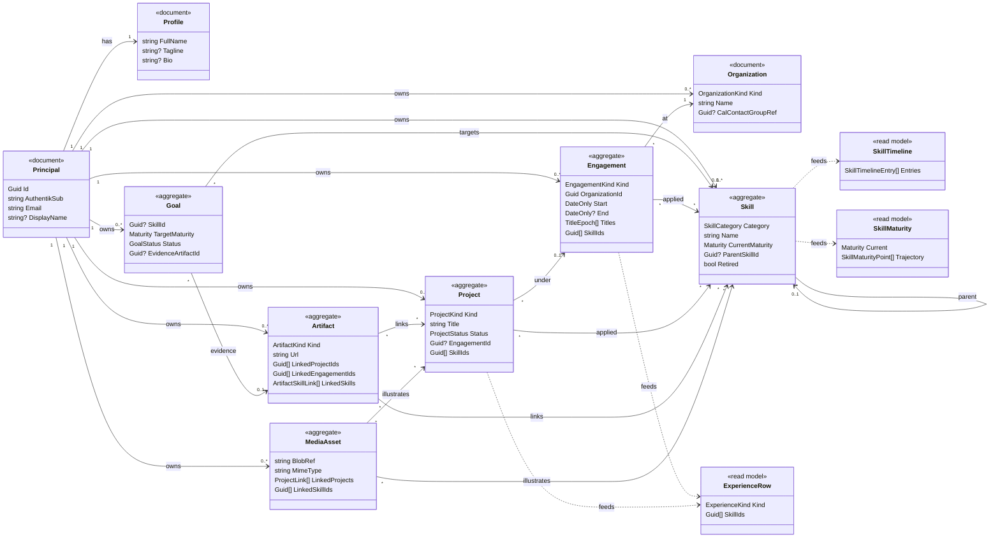

# Architecture

LupiraCareerApi is a single bounded context — the **career graph** — implemented with event sourcing
on PostgreSQL via [Marten](https://martendb.io). This document covers the domain model, the storage
strategy, the ownership/identity model, and how service outcomes map onto the REST and MCP transports.

## Projects

Two projects, with a compiler-enforced boundary:

- **`LupiraCareerApi.Core`** — the bounded context. Domain (aggregates, events, projections, value
  objects), Application (services returning a transport-neutral `OpResult`), DTOs, mappers, and the
  Marten registration. **No ASP.NET dependency.**
- **`LupiraCareerApi`** — the host: authentication, HTTP problem-details, thin endpoints →
  handlers, the MCP server, health checks, and `Program.cs`.

The host depends on Core; Core cannot depend on the host. Marten/Npgsql flow in transitively through
Core, so the storage choice stays an implementation detail of the context, not the transport.

## Domain model

### Event-sourced aggregates

Each is one event stream per instance, with an **inline snapshot** projection so writes are
read-your-write.

| Aggregate | What it is | Notable transitions |
|---|---|---|
| **Engagement** | A time-boxed relationship with an organization (employment / study / volunteer / hobby / open-source), carrying a history of job titles (`TitleEpoch`). | start/end, retitle, relocate, attach/detach skill |
| **Project** | A piece of work, optionally filed under an engagement, with a lifecycle. | ship / shelve / archive, attach/detach skill |
| **Skill** | A competence whose maturity evolves through dated edge events. Self-referential (`ParentSkillId`) for skill hierarchies. | learn, apply, deepen, teach, reference, combine, retire |
| **Goal** | A skill-development target. **Private by design** — never on a public path. | record progress, achieve (with evidence artifact), abandon |
| **Artifact** | External evidence of work — repo, PR, talk, certification, paper — linkable to projects, skills, engagements (each link carries a role). | register, update, link/unlink, archive |
| **MediaAsset** | An image/media blob illustrating projects and skills; `BlobRef` is the object-store key (blobs live on external object storage, not in Postgres). | register, link/unlink, replace, archive |

Enums (e.g. `EngagementKind`, `ProjectStatus`, `SkillCategory`, `Maturity` =
`Aware → Working → Fluent → Expert → Teaching`) serialize **as strings**.

### Plain documents

Not event-sourced — there is no history worth replaying:

- **Principal** — the identity anchor (see [Identity](#identity)).
- **Profile** — per-principal "about me" (one per principal).
- **Organization** — an employer / institution of record, deduped across engagements.

### Derived read models

Inline projections rebuilt as events are appended:

- **SkillTimeline** — the chronological edge history of one skill (single-stream).
- **SkillMaturity** — a skill's current maturity plus the trajectory that produced it (single-stream).
- **ExperienceRow** — a unified, owner-scoped timeline of engagements *and* projects with their
  applied skills (**multi-stream** — keyed off both engagement and project events).

`GET /resume` and `GET /experience` compose these. **Reverse-link views** (the artifacts/media
attached to a given project/skill/engagement) are *not* dedicated projections — they are served by
query-time `Contains()` lookups in the services, which is appropriate at personal-portfolio scale.

## Storage (Marten)

A single Marten store, configured in [`MartenRegistrations.cs`](../src/LupiraCareerApi.Core/MartenRegistrations.cs):

- Everything lives in the **`career`** schema; enums are stored as strings (System.Text.Json).
- Aggregates use `Snapshot<T>(SnapshotLifecycle.Inline)`; derived models are `Inline` projections.
- Documents (`Principal`, `Profile`, `Organization`) get the indexes the services query by
  (`AuthentikSub`, `Email`, `OwnerPrincipalId`).

The schema is **Marten-managed but applied deliberately**, not on boot — run the host once with
`--apply-schema` (it calls `ApplyAllConfiguredChangesToDatabaseAsync()` and exits). Most evolution is
additive: new event types don't alter the schema and a new projection just adds a table.

## Ownership & multi-principal isolation

Every aggregate and document carries an `OwnerPrincipalId`. All reads and writes are scoped to the
caller's principal, and **a request for an id the caller doesn't own returns `404`, not `403`** — the
existence of another principal's data is never leaked. The store is therefore safely multi-principal:
several people can use one deployment without seeing each other's career graphs.

## Identity

A **Principal** is JIT-provisioned on first authenticated request: resolved by the OIDC `sub` (durable
key), falling back to email (mutable). There is no separate sign-up step. This is deliberately the same
anchoring scheme a sibling activity/calendar API can use, so two services converge on the same person
**without a shared table**.

## Outcomes → transport

Application services never throw for expected conditions; they return an `OpResult` / `OpResult<T>`
carrying an `OpStatus` (`Ok`, `NotFound`, `Forbidden`, `Invalid`, `Conflict`). Each transport maps that
one type its own way:

- **REST** → [`OpResultMapping`](../src/LupiraCareerApi/Http/OpResultMapping.cs) translates it to
  `TypedResults` and, on failure, RFC 7807 `application/problem+json`.
- **MCP** → [`CareerTools.Require`](../src/LupiraCareerApi/Mcp/CareerTools.cs) unwraps the value or
  raises a structured tool error.

So both surfaces sit on the *same* Core services with identical authorization and validation — the
transport only decides how a result is rendered.

## Bounded-context boundary

The career graph is intentionally decoupled from any activity/calendar context. Such a sibling is
authoritative on *"what I was invited to / attended / did"*; this API is authoritative on *"who I am
professionally over time and what I can do."* They share only the OIDC subject — **no shared tables**.
Cross-references are soft and one-way: a skill edge's context may carry an external URL pointing at an
activity entity, and an `Organization` may optionally reference a counterpart group elsewhere
(`CalContactGroupRef`), but neither side is master of the other.
